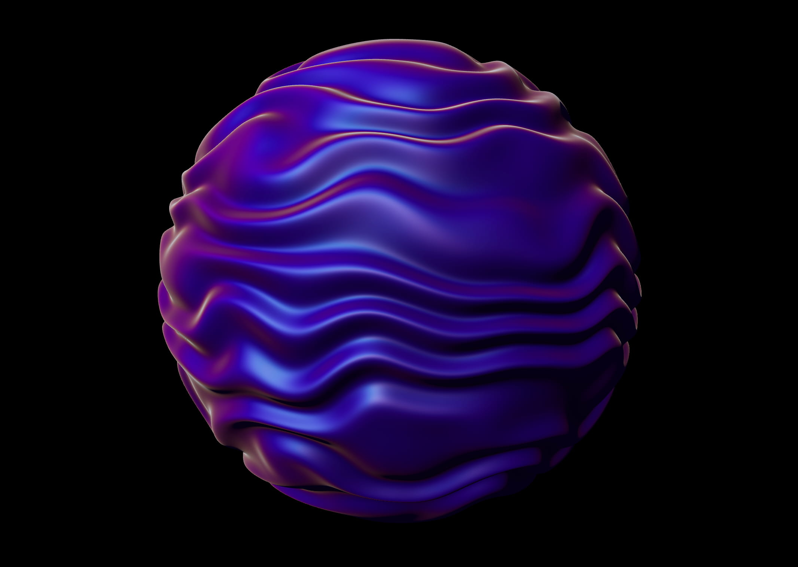

# Creating an Animated Displaced Sphere with a Custom Three.js Material

Exploring the possibilities of creating a custom material using shaders based on built-in Three.js materials with React Three Fiber.



[Article on Codrops](https://tympanus.net/codrops/?p=78913)

[Demo](http://tympanus.net/Tutorials/DistortedSphereCustomMaterial/)

## Installation

```
npm install
npm run dev
```

## Misc

Follow _Pavel Mazhuga_: [Twitter](https://x.com/PMazhuga), [Instagram](https://www.instagram.com/mazhuga.gl), [GitHub](https://github.com/pavel-mazhuga/), [Website](https://pavelmazhuga.com)

Follow Codrops: [X](http://www.X.com/codrops), [Facebook](http://www.facebook.com/codrops), [GitHub](https://github.com/codrops), [Instagram](https://www.instagram.com/codropsss/)

## License

[MIT](LICENSE)

Made with :blue_heart: by [Codrops](http://www.codrops.com) and [Pavel Mazhuga](https://x.com/PMazhuga)
